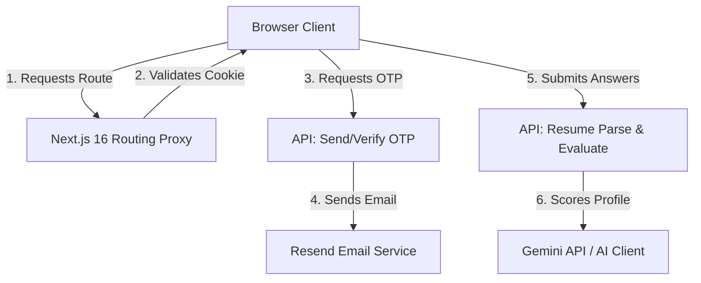

/**
 * 💡 WHAT THIS FILE DOES:
 * This is the Technical Design document for the AI Skill Assessor project.
 * It outlines the architecture, database-less design, authentication mechanism (Next.js 16 Proxy + OTP),
 * and the user interface styling system so that any engineer or product owner can understand
 * how the system is built and how data flows through it.
 */

# Technical Design Document: AI Skill Assessor

This document details the system design, user experience design system, and authentication flow.

---

## 1. System Architecture

The AI Skill Assessor is a full-stack web application built on **Next.js 16 (App Router)** and **React 19**. It utilizes a database-less architecture, relying on secure client cookies for session management and in-memory caches on the server for temporary validation codes (OTPs).

---

## 2. Authentication & Session Flow

The login system validates users using their email address and a single-use verification code (One-Time Password) sent via the **Resend API**.

### OTP Generation & Storage
1. The user requests a code for their email.
2. The server generates a random 6-digit number.
3. The server saves this code to a memory map ([otp-store.ts](file:///Users/anjaliprajapati/Skill-Assessment-Agentic-AI/src/lib/otp-store.ts)) mapped to the user's email, set to expire in 5 minutes.
4. If a `RESEND_API_KEY` is present, it emails the code. If not, it runs in **Development Mode**, returning the code in the API and logging it to the console.

### Session Establishment
1. The user inputs their 6-digit code.
2. The server compares the code against the memory map. If it matches, the entry is deleted immediately.
3. A secure, HTTP-only cookie `session_token` containing base64-encoded session metadata is written to the user's browser.
4. The **Next.js Routing Proxy** ([proxy.ts](file:///Users/anjaliprajapati/Skill-Assessment-Agentic-AI/src/proxy.ts)) checks this cookie on every protected page request.

---

- **Core Gradients & Accents**: Utilize the signature cyan (`#22d3ee` / `oklch(0.78 0.1 195)`) and gold/amber (`#fbbf24` / `oklch(0.81 0.1 86)`) for glowing accents and gradients.
- **Glassmorphism**: Glassmorphic cards use a semi-transparent white/slate base (`bg-white/82` or similar) with fine white borders (`border-white/70`) and backdrop blur (`backdrop-blur-xl`).
- **Micro-Animations**: Uses dynamic entry transitions (`animate-fade-in`), active input pulses (`animate-pulse`), and hover scale adjustments to keep the interface engaging.
- **Typography**: Employs geometric and Optima/Avenir Next styled headers (`var(--font-heading)`) paired with high-legibility body font faces (`var(--font-sans)`).

---

## 4. UI Styling Rules (for Future Implementation)

To maintain design consistency across new pages, components, or feature branches, engineers should follow these style directives:

1. **Adhere to the Global Light Ambient Theme**:
   - The global layout relies on the fixed body background containing soft cyan and gold ambient spots over a light, warm gradient.
   - Do not hardcode deep dark backgrounds (like pure blacks or deep dark grays) for standalone views. Always design components with the light gold-cyan glassmorphic card patterns.

2. **Accents and Button Gradients**:
   - Actions and CTA elements should utilize gradients from Cyan-500 to Gold/Amber-500 (`from-cyan-500 to-amber-500`).
   - Button states must support interactive hover transitions (e.g. slight brightness raise, shadow enlargement, and `active:scale-[0.98]`).

3. **Form Elements & Inputs**:
   - Focus states should be clean and thin. Apply `focus:border-cyan-400 focus:ring-cyan-400/30` rather than thick default borders.
   - Placeholders must use muted slates (`text-slate-400`).

4. **Error & Warning Alerts**:
   - Use soft red/rose alert containers with delicate boundaries matching the main dashboard layout: `bg-rose-50/90 border border-rose-200/80 text-rose-700`.
   - Use soft cyan/blue alert containers for informational alerts: `bg-cyan-50/80 border border-cyan-100 text-cyan-800`.

